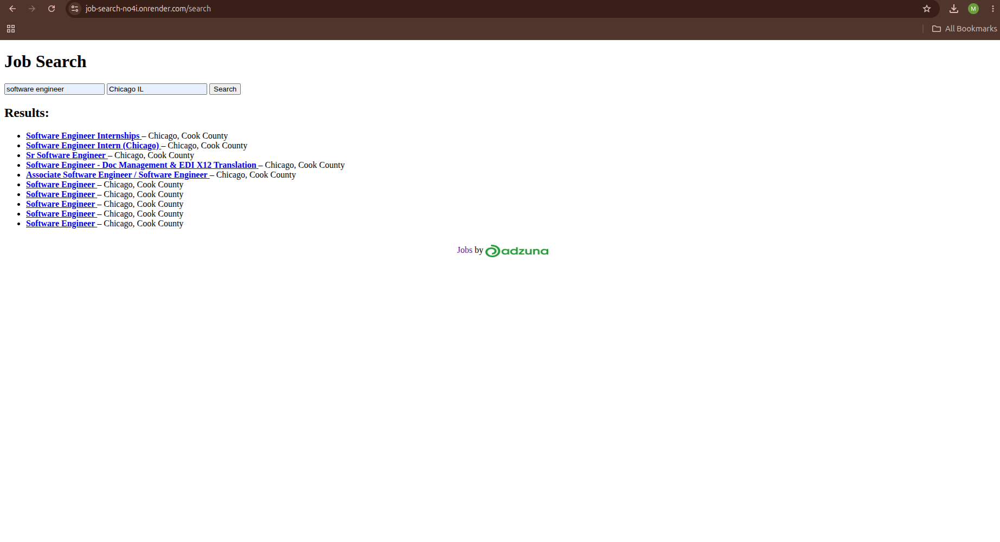

# Job Search

A Ruby job search web app that uses the Adzuna API to search and display job listings.

## Features

- Search for jobs by keyword
- Display job listings from the Adzuna API
- View job title, company, location, and listing links
- Simple Ruby/Sinatra web interface

## Tech Stack

- Ruby
- Sinatra
- HTML
- CSS
- Adzuna API
- Render

## Live Demo

[View the live app](https://job-search-no4i.onrender.com/)

## What I Learned

- How to connect a Ruby app to an external API
- How to handle API responses
- How to structure routes and views in a small web app
- How to deploy a Ruby app

## Future Improvements

- Add location filters
- Improve styling
- Add pagination
- Add saved searches
- Add tests
This is an Adzuna US job search app where you enter a job title and location in the US and it gives you any job openings for that job title in the location you entered.  It has been deployed to Render at: https://job-search-no4i.onrender.com 
